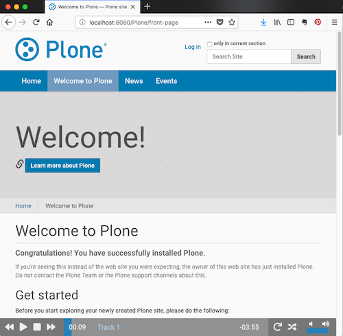
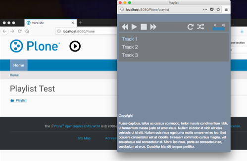

***************************
Player for Audio Playlist
***************************

.. contents:: Table of Contents

Summary
============
 
The Plone add-on collective.playlist provides a playlist and a track content type. The player is per default a sticky footer. Optional as an alternative is a player in a pop up window that can be launched via a play button.

Sticky Footer
=============

The site is navigable while the player continues to play.

    Sticky Footer Player

    Sticky Footer Player on Mobile Device
    

Pop Up Player
=============

A click on the play button opens a window with playlist and player.

    Playlist

    Playlist on Mobile Device

Documentation
=============

Initial playlist
----------------

An initial playlist with tracks is created at /playlist.

The Add-On uses JPlayer_.

Sticky Footer
-------------

The site is navigable while the player continues to play thanks to pjax_. Pjax works with browsers that support the history.pushState() API. When the API isn't supported, Pjax goes into fallback mode (and it just does nothing). `Browser Support`_

The sticky footer is shown if and only if a published playlist exists. For a qualified user it's shown anyway.

Pop Up Player
-------------

The pop up player is per default deactivated. You can activate it via @@manage-viewlets view like
localhost:8080/Plone/@@manage-viewlets

A play button is shown on top of each page if and only if a published playlist exists. For a qualified user it's shown anyway.

Click the play button to open the player. A menu to edit the playlist and its tracks is presented to qualified users.

Customizations
===============

Layout
------

Layout can be modified in control panel.

Change Font
-------------

.. figure:: font.png
    :width: 300px
    :align: center
    :alt: How to use your font

    Use your font

Background Image for your Pop Up Playlist
------------------------------------------

Upload an image "background.jpg" to your Plone-Site.

Go to playlist control panel and add::

    html {
        background-image:url("background.jpg");
    }

Translations
==============

This product has been translated into

- german

Installation
==============

Install collective.playlist by adding it to your buildout.

Plone Version Compatibility
============================

Plone 5

.. image:: https://travis-ci.org/collective/collective.playlist.svg?branch=master&t=1002
    :target: https://travis-ci.org/collective/collective.playlist
    
.. image:: https://coveralls.io/repos/github/collective/collective.playlist/badge.svg?branch=master&t=1002
    :target: https://coveralls.io/github/collective/collective.playlist?branch=master

Contribute
============

- Issue Tracker: https://github.com/collective/collective.playlist/issues
- Source Code: https://github.com/collective/collective.playlist

License
========

The project is licensed under the GPLv2.

Music:
© 2003 Miaow / Arnaud Laflaquiere - MiaowMusic.net

For JPLayer license see JPlayer_

Credits
=========

Developed with the support of:

.. image:: zhref.png
    :width: 220px
    :align: left
    :alt: Reformierte Kirche Kanton Zürich
    :target: http://www.zhref.ch

Author
========

- Katja Süss, Rohberg ( @ksuess )

Footnotes
============

.. target-notes::

.. _JPlayer: http://jplayer.org/latest/demo-02-multi/
.. _pjax: https://github.com/MoOx/pjax
.. _Browser Support: https://caniuse.com/#search=pushstate
